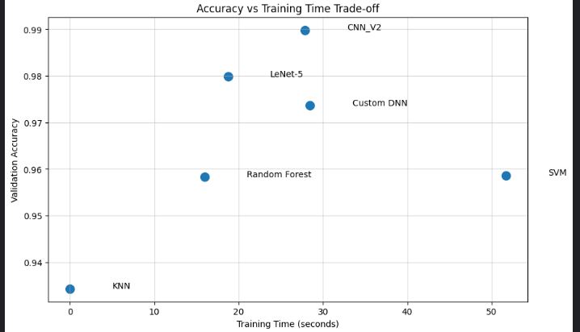
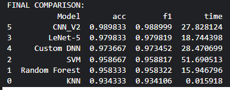
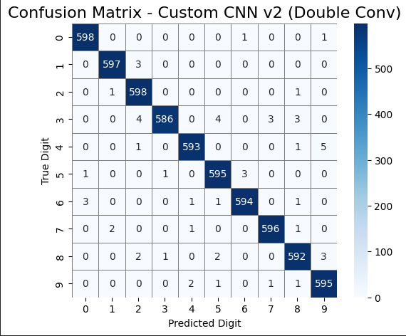
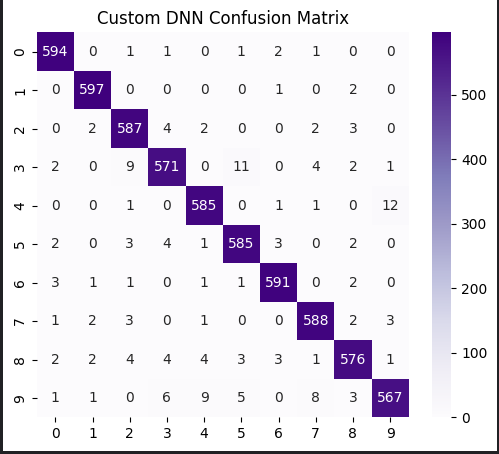
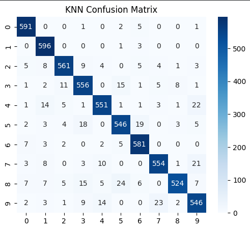
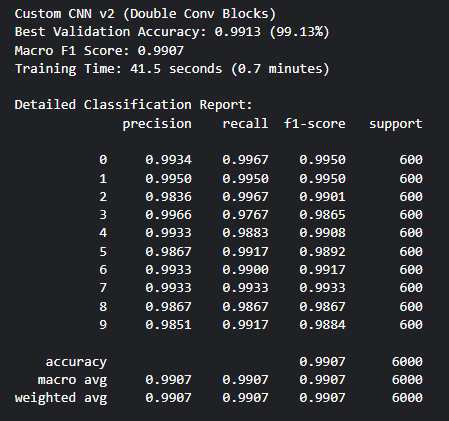

🎯 Comparative Analysis — ML vs DL on Images

	
	
	

This repository contains a notebook comparing classical machine learning (ML) models and deep learning (DL) models for image classification (MNIST-style Digit Recognizer).

Kaggle notebook (original project):

https://www.kaggle.com/code/muhammadhassnain11/comparative-analysis-of-ml-vs-dl-models-on-images

Files
- `comparative-analysis-of-ml-vs-dl-models-on-images.ipynb` — Main notebook with data preprocessing, model training, evaluation, and visualizations.

Quick Usage
- Open the notebook in Jupyter and run cells sequentially. See the first cells for environment and dataset instructions.

✨ Extracted details (from the notebook)
- **Dataset:** Kaggle Digit Recognizer CSVs (`/kaggle/input/digit-recognizer/train.csv`, `/kaggle/input/digit-recognizer/test.csv`).
- **Sampling:** `n_samples_per_label = 3000` (per-class balanced sampling).
- **Preprocessing:** pixel scaling `/255.0`, CNN reshape `(28,28,1)`, ML features scaled with `StandardScaler()`.
- **Classical ML models:** `KNN`, `RandomForest`, `SVM` (trained on scaled features).
- **DL models & key hyperparams:**
	- **`CNN_V2`** — optimizer: `adam`, loss: `sparse_categorical_crossentropy`, epochs: `50`, batch_size: `64`, EarlyStopping(monitor=`val_loss`, patience=`4`), dropout: `0.3/0.4/0.5`, dense: `256` units.
	- **`LeNet-5`** — optimizer: `adam`, epochs: `50`, batch_size: `64`.
	- **`Custom DNN`** — dense layers `[512,256,128]`, optimizer: `adam`, epochs: `50`, batch_size: `51`.
- **Evaluation:** accuracy, macro F1, classification reports, confusion matrices; aggregated into `ml_results` (`acc`, `f1`, `time`).
- **Inference:** notebook runs predictions on the unlabeled test CSV and computes agreement/confidence across models.

📸 Results (preview)
Here are representative result images produced by the notebook and saved in the `Results/` folder. Thumbnails are shown — click to open full-size.

-- Overall comparison

	
	 
	<strong>Figure 1</strong> — Overall accuracy & training-time trade-off

	
	 
	<strong>Figure 2</strong> — Detailed comparison table

-- Learning curves (examples)

	
	
	
	 
	<strong>Figure 3</strong> — Learning curves (CNN | DNN | LeNet)

-- Confusion matrices (examples)

	
	
	
	 
	<strong>Figure 4</strong> — Confusion matrices (CNN | DNN | KNN)

-- Per-model metric charts (examples)

	
	
	
	 
	<strong>Figure 5</strong> — Per-model metric charts

> Note: Filenames are renamed to use underscores for cleaner links. If you prefer different thumbnail sizes or captions, tell me which style you like and I will adjust.
